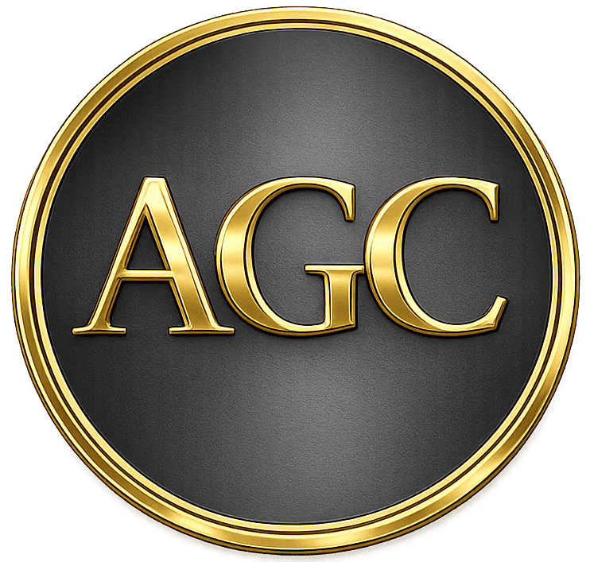

  

# Genesis Core (AGC)

Genesis Core (AGC) is a utility token deployed on the Polygon (PoS) network.  
The project is focused on building a foundational core token that can be integrated
into future Web3, NFT, and community-driven ecosystems.

---

## Token Overview

- **Token Name:** Genesis Core  
- **Symbol:** AGC  
- **Network:** Polygon (PoS)  
- **Contract Address:**  
  `0xF5850Ef30c280B66C3DeD80291A6aBe50c2A3360`

---

## Supply Information

- **Initial Minted Supply:** 1,000 AGC  
- **Future Planned Mint:** up to 10,000 AGC  
- **Minting Status:** Controlled, not automatic

The initial supply is intentionally limited.  
Future minting will only be executed according to project governance decisions.

---

## Trading & Liquidity

AGC is traded via decentralized liquidity pools on the Polygon network.

Price and liquidity tracking is available on GeckoTerminal:  
https://www.geckoterminal.com/polygon_pos/pools/0x94d3a1fe4c8bc32ced23f2ae2d3f2169e1f7b0b5

---

## Project Status

- Token contract deployed
- Initial supply minted
- Liquidity pool created
- Repository maintained as the official reference point

---

## Repository Purpose

This repository serves as the **official source** for:
- Token information
- Public references
- Metadata and documentation related to Genesis Core (AGC)

---

## Disclaimer

Genesis Core (AGC) is provided as-is.  
Nothing in this repository constitutes financial advice.  
Always do your own research (DYOR).
